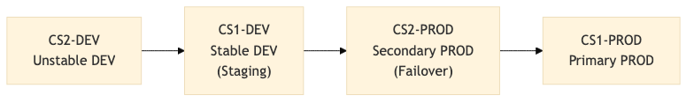

# NZ Data Delivery: Jenkins Helm Design Document

## Introduction

### Purpose

This document outlines the technical design for deploying and configuring Jenkins using Helm and Infrastructure as Code (IaC) principles for Data Delivery. The solution leverages Jenkins Configuration as Code (JCasC) and JobDSL to provide fully automated, version-controlled, and reproducible Jenkins deployment.

There were several factors that went into choosing this solution over others;

1. Most other teams that use Jenkins were also using this solution so there is already a large community within ANZ we can lean on when needed
2. This solution allows us to completely automate the entire build and configuration of the infrastructure with no manual intervention required (some manual steps exist as an intentional choice)
3. It allows us to reference other team's implementations but also allows us to innovate and improve on their designs
4. It allows us to build and maintain our own images, instead of relying on other teams to keep them updated
5. It uses an industry standard tool which we can learn an apply to future projects

### Scope

The solution encompasses;

* Helm chart deployment configuration for Jenkins
* Jenkins Configuration as Code (JCasC) implementation
* JobDSL scripts for pipeline and job definitions
* Required plugins and their configuration
* Security and access control specification
* Backup and disaster recovery considerations
* Wrapper scripts maintained by the community

### Business Opportunity

This solution addresses several key business requirements:

* Standardisation of Jenkins deployments across environments
* Version control of Jenkins configuration
* Reduction in manual configuration effort and human error
* Improved disaster recovery capabilities
* Enhanced security through code-defined access control

### Techical Overview

The solution utilises the following key technologies and approaches:

1. Helm: A package manager for Kubernetes that manages Jenkins deployments and dependencies
    * Manages Jenkins deployments and its dependencies
    * Handles configuration templating
    * Enables version control of deployment configurations
2. Jenkins Configuration as Code (JCasC): Allows defining Jenkins system configuration in YAML format
    * Defines Jenkins system configuration in YAML format
    * Includes security settings, plugin configurations and system properties
    * Enables automated configuration management
3. JobDSL: Allows for Jenkins jobs to be described as code in its own domain specific language
    * Programatically defines Jenkins jobs and pipelines
    * Ensures consistency in job configurations
    * Facilitates version control of job definitions
4. Wrapper Scripts
    * Maintained by the community and the team
    * Simplifies various aspects of the lifecycle
    * Enables the complete automation of the solution

### Success Criteria

The solution will be considered successful when:

* Jenkins can be deployed consistently across environments using Helm
* All configuration changes are made through version-controlled code
* Jobs and pipelines are automatically created through JobDSL
* Zero manual intervention is required post-deployment
* Backup and restore procedures are automated and tested
* Security controls are properly implemented and validated

## ANZ Jenkins Helm Project

The Jenkins-Helm repository in ANZ is maintained by the Digital team however it is considered a community project within the NZ developer community. They accept contributions by the community but as the owners of the repository, they diligently review and ultimately approve or reject any contributions to the repository. As part of this project, the Skynet team have contributed a number of features which we required to ensure full compatibilty of our existing Jenkins configuration and also to allow us to completely automate the deployment of the Jenkins Helm environments.

Since the [Jenkins-Helm repository](https://bitbucket.nz.service.anz/projects/DIG/repos/jenkins-helm/browse) is owned by the Digital team and used by many teams across NZ, there is a folder structure and conventions which we have continued to follow.

* Teams can place their bespoke environment configuration in a folder under the `sites` folder. We have placed ours under [sites/nzdd-deployments](https://bitbucket.nz.service.anz/projects/DIG/repos/jenkins-helm/browse/sites/nzdd-deployments).
* When creating configuration for different environments, we are able to place configuration options that are common across environments in separate files and then include them as well as environment specific configuration files. These deployment environments are stored in the [sites/nzdd-deployments/config.sh](https://bitbucket.nz.service.anz/projects/DIG/repos/jenkins-helm/browse/sites/nzdd-deployments/config.sh) file.
* Teams are able to use the default Jenkins Controller image maintained by the Digital team or specify a custom image. We have chosen to maintain our own image which we store in [Artifactory Staging](https://artifactory-staging.nz.service.anz/ui/repos/tree/General/docker-nzdd-local/rhcr/rhel8/jenkins).
* Team can use the [deploy.sh](https://bitbucket.nz.service.anz/projects/DIG/repos/jenkins-helm/browse/deploy.sh) script to deploy their configuration to any environment. We have chosed to wrap this script with our own [run.sh](https://bitbucket.nz.service.anz/projects/DIG/repos/jenkins-helm/browse/sites/nzdd-deployments/run.sh) script which performs additional operations before and after deployment.

### Skynet Team Conventions

On top of the standards and conventions that the part of the Jenkins-Helm repo, we have added a few extra standards that our team uses.

* Since we have four environments we want to deploy, we have built our Helm configuration in a way which allows us to have a single "answer file" per environment. This simplifies the maintenance of our configration by centralising the variations into a single file for each environment.
* Any answer file with a filename ending in *-test* will also have its corresponding route suffixed with *-test*. For example, *cs2-dev-test* has this route `nzdd-deployments-test.apps.cs2-dev.nz.service.test`.
* We should always keep all our DEV and PROD images (`pod-templates.yaml`) the same across all environments.
* We use the `run.sh` scripts in our repository to deploy our environments not the `deploy.sh` script.

### Community

Since the Jenkins-Helm project is effectively an internal community project, we need to note how to reach out to the community. This is mainly done via the [Jenkins MSTeams Channel](https://teams.microsoft.com/l/channel/19%3Afafde8310faf494ba4418f18e457d608%40thread.tacv2/Jenkins?groupId=937b73e9-e9be-4b02-95d0-1773ee12fad8&tenantId=1f4f7eda-6e51-425e-a0f9-4c2fcef58a52).

## Lifecycle

This section describes the various aspects to consider when developing then eventually deploying through the environments.

### Environments

This diagram outlines the general development and release workflow across the various environments.

> Please note that this section and diagram illustrates our intended "end state" not our current state.

#### CS2-DEV - Unstable DEV

This environment is the starting point for developing new features. The support team can consider this environment a playground to test new features, new versions, bug fixes, etc.

#### CS1-DEV - Stable DEV (Staging)

This environment should be kept to be as close to PROD as possible. This means only deploying to this environment once the branch is ready for production and final testing needs to be performed. If the branch is deployed to this environment and testing fails, it should be rolled back to the PROD branch (master) once all the troubleshooting information has been gathered.

#### CS2-PROD - Secondary PROD (Fail-over)

This environment is considered a mirror of production and is always "ready-to-go" in the event of a disaster. We also deploy to this environment as a final test in the production environment before rolling out to the primary Jenkins environment.

#### CS1-PROD - Primary PROD

This environment is considered the primary Jenkins instance which runs all the DEV and PROD Jenkins pipelines. The data stored in this instance is periodically replicated over to the secondary instance and the staging instance.

### Deployment Workflow

Once a configuration change is ready to be deployed, we can use the `run.sh` script to deploy to any environment. This diagram outlines the deployment steps performed by the `run.sh` and `deploy.sh` scripts.

 

The exact deployment commands have been documentated in the [nzdd-deployments/README.md](../README.md) file.

## Dependencies

### Access Control

Maintainers of the Jenkins Helm solution in Data Delivery need to be members of the following groups to be able to properly manage the environments as administrators.

| Domain     | Account Type  | Group Name                                 | Access System                     |
|------------|---------------|--------------------------------------------|-----------------------------------|
| GLOBALTEST | Admin         | NZ Admin Role - Data Delivery Support      | OpenShift, Jenkins, PREPROD Vault |
| GLOBAL     | Standard User | NZ Data Analytics Openshift Project Admins | OpenShift, Jenkins                |
| GLOBAL     | Standard User | NZDW Pipeline Support                      | PROD Vault                        |

#### Vault Access

Being a member of:

* `NZ Admin Role - Data Delivery Support` will grant you admin access to [secret > context > nzdd-jenkins-dev](https://vault-preprod.nzlb.service.test:8200/ui/vault/secrets/secret/kv/list/context/nzdd-jenkins-dev/?namespace=nonprod) in PRE-PROD Vault
* `NZDW Pipeline Support` will grant you admin access to [secret > context > nzdd-jenkins-prod](https://vault.nzlb.service.anz:8200/ui/vault/secrets/secret/kv/list/context/nzdd-jenkins-prod/?namespace=prod) in PROD Vault

#### OpenShift Access

Being a member of:

* `NZ Admin Role - Data Delivery Support` will grant you admin access to the `nzdd-jenkins-dev` namespace in [cs1-dev](https://console-openshift-console.apps.cs1-dev.nz.service.test/) and [cs2-dev](https://console-openshift-console.apps.cs2-dev.nz.service.test/)
* `NZ Data Analytics Openshift Project Admins` will grant you admin access to the `nzdd-jenkins-prod` namespace in [cs1](https://console-openshift-console.apps.cs1.nz.service.anz/) and [cs2](https://console-openshift-console.apps.cs2.nz.service.anz/) (PROD)

#### Jenkins Access

Being a member of:

* `NZ Admin Role - Data Delivery Support` will grant you admin access to the following instances:
  * [nzdd-deployments.apps.cs1-dev.nz.service.test](https://nzdd-deployments.apps.cs1-dev.nz.service.test/)
  * [nzdd-deployments-test.apps.cs2-dev.nz.service.test](https://nzdd-deployments-test.apps.cs2-dev.nz.service.test/)
* `NZDW Pipeline Support` will grant you admin access to the following instances:
  * [nzdd-deployments.apps.cs1.nz.service.anz](https://nzdd-deployments.apps.cs1.nz.service.anz/)
  * [nzdd-deployments-test.apps.cs2.nz.service.anz](https://nzdd-deployments-test.apps.cs2.nz.service.anz/)

### Vault

To be able to successfully deploy any of the `nzdd-deployment` site variants on OpenShift, the pod must have access to Vault. This is because the Helm Chart is actually enabled for Vault which is configured via a set of (machine wide) environment variables in `common.yaml`.

* CASC_VAULT_URL
* CASC_VAULT_MOUNT
* CASC_VAULT_PATHS
* CASC_VAULT_NAMESPACE
* CASC_VAULT_KUBERNETES_ROLE

When these are configured at the machine level, it makes any secret configured in the path specified in `CASC_VAULT_PATHS` (`secret/context/nzdd-jenkins-dev/jenkins/jcasc`) available to the Helm chart to use as a variable. You can see how this is used by checking any of the answer files and looking at anything which follows this convention `${TD_CONTROL_TABLE_UN}`.

Using `${TD_CONTROL_TABLE_UN}` as an example, we can log in to PRE-PROD Vault and navigate to the path `secret/context/nzdd-jenkins-dev/jenkins/jcasc` to see a secret labelled `TD_CONTROL_TABLE_UN` which has a value of `tdctltbluserdsa`. This value is simply injected at runtime when the pod is running and processing the configuration.

If you perform a deployment and are unable to log into Jenkins via LDAP (an your account isn't locked out or expired), it's likely that something has gone wrong fetching credentials from Vault and so the LDAP configuration won't have the injected credentials and will use the variable name in it's place `AD_SERVICE_ACCOUNT_UN`. You will see this in the log output, that mentions that an LDAP bind could not happen.

> Note that Jenkins will still boot to the login page even if there was an issue connecting to Vault. But you just won't be able to log in as noted above.

### Skynet Ops Jenkins Instance

The [Skynet Ops Jenkins Instance](https://nzdd-jenkins-ops.apps.cs2-dev.nz.service.test/) is a separate (private) Jenkins instance used by the Skynet to automate activities that are just relevant to the Skynet team.

In the context of Jenkins Helm, this instance performs two important operations;

1. It build and publishes container images to Artifactory
2. It is able to deploy Jenkins Helm instances to the various environments

The building and pushing of container images is described in the next section (Artifactory Staging) so we'll briefly discuss the deployment aspect here.

Since we want to get to a point where we are regularly upgrading our Jenkins versions and plugins, we have automated the build and deployment of our Jenkins instances. Once logged into the Skynet Ops instance, you can go to the [Helm - Deploy Jenkins Instance (nzdd-deployments)](https://nzdd-jenkins-ops.apps.cs2-dev.nz.service.test/job/Helm%20-%20Deploy%20Jenkins%20Instance%20(nzdd-deployments)/) job and build with parameters. When asked to provide parameters, you can select the variant to deploy and the name of the branch, the same as if you were deploying from your local machine. When deploying to a production environment, we also require a Change Request number.

As well as enabling automated deployments of our Jenkins environment, having this performed by a Jenkins job should reduce human error.

### Container Images on Artifactory Staging

Our pipelines rely on Agent nodes to be spun up at various points in their lifecycle to perform activities using specific tools. These agent nodes are container images which we are hosting on [Artifactory Staging](https://artifactory-staging.nz.service.anz/ui/repos/tree/General/docker-nzdd-local/rhcr/rhel8). These images are pulled down and executed whenever a pipeline needs them. We have consolidated our various pipeline images to be the same across both DEV and PROD environments (`pod-templates.yaml`) so there is no need to differentiate between the environments. We maintain our own images because we intend to have more images in the future which will contain specific / bespoke tooling we may require in our future pipelines. The source for these images are located in the [nzdd-ops](https://bitbucket.nz.service.anz/projects/NZDD-OPS) BitBucket project.

Currently, we have these images:

* [https://bitbucket.nz.service.anz/projects/NZDD-OPS/repos/rhcr-jenkins/browse](https://bitbucket.nz.service.anz/projects/NZDD-OPS/repos/rhcr-jenkins/browse)
* [https://bitbucket.nz.service.anz/projects/NZDD-OPS/repos/rhcr-jenkins-agent-base/browse](https://bitbucket.nz.service.anz/projects/NZDD-OPS/repos/rhcr-jenkins-agent-base/browse)
* [https://bitbucket.nz.service.anz/projects/NZDD-OPS/repos/rhcr-jenkins-agent-gradle/browse](https://bitbucket.nz.service.anz/projects/NZDD-OPS/repos/rhcr-jenkins-agent-gradle/browse)
* [https://bitbucket.nz.service.anz/projects/NZDD-OPS/repos/rhcr-jenkins-agent-helm/browse](https://bitbucket.nz.service.anz/projects/NZDD-OPS/repos/rhcr-jenkins-agent-helm/browse)

The images are built by the [Skynet Ops Jenkins instance](https://nzdd-jenkins-ops.apps.cs2-dev.nz.service.test/) then pushed to [Artifactory Staging](https://artifactory-staging.nz.service.anz/ui/repos/tree/General/docker-nzdd-local/rhcr/rhel8). These images have both the DEV and PROD certificate authorities injected which allow the same image to work in both DEV and PROD environments.

Our future state is to have these images promoted to Artifactory PROD and to use those images instead at which point we may need to have separate DEV and PROD images.

### Image Promotion and digital-image-builds

Jenkins Controller images are built automatically by the `deploy.sh` script when a change is detected to the base image or the `plugins.txt` file. If a rebuild is required, it is always performed in the DEV environment, in the `digital-image-builds` OpenShift namespace (owned by the Digital team). When the `IMAGE_NAMESPACE` variable is specified (in `config.sh`), the image will then be pushed to that namespace in DEV but if it isn't, it is left in the `digital-image-builds` namespace and can be run from there. In our case, we do explicity specify our `nzdd-jenkins-dev` namespace (so the image will be copied over into that namespace).

For PROD, images are not built in PROD, instead, they are promoted from DEV. The idea behind this is that you are using the exact same image in DEV and PROD, which should reduce the number of issues when releasing to PROD.

Images built in DEV can only be promoted into its sister PROD cluster, meaning an image built in the CS1-DEV OpenShift cluster can only be promoted into the CS1-PROD OpenShift cluster. This is simply because of the way the `deploy.sh` script is built.

The `deploy.sh` script typically expects the `IMAGE_NAMESPACE` to be the same in both DEV and PROD however, we introduced the ability to specify an alternative namespace in PROD via the `PROD_IMAGE_NAMESPACE` variable. So in our case, our images are built in the `nzdd-jenkins-dev` namespace in DEV, then pushed into the `nzdd-jenkins-prod` namespace in PROD.

### Backup and Restore

Even though our complete infrastructure build is defined with code, there are some aspects of Jenkins which are stateful (that change throughout the life of the instance). Things like the next build number, build logs, artifacts and history are all stored on disk. This means if we were to redeploy completely fresh, the build numbers would start from #1 again. In our case, we want to ensure we are continuing the build numbers so records that are stored outside of Jenkins (such as Drivetrain) are correctly linking to their build numbers.

Jenkins has the ability to backup and restore its state via the ThinBackup plugin however we have added extra functionality via two Jenkins jobs;

* Artifactory - Download Backup
* Artifactory - Upload Backup

These allow us to push the backup that is created by the ThinBackup plugin to Artifactory Staging and also to restore it by downloading the backup from Artifactory Staging then running ThinBackup. With this abilty, we intend to perform regular backup and restores automatically across all our environments. Essentially, CS2-PROD will have the most recent CS1-PROD backup restored nightly and the same for the DEV environment. This means that in the event of a disaster, we are able get to a fairly recent state of the original production instance.

These jobs have also been defined via JobDSL so they are already part of our Jenkins Helm configuration.

## Release Cadence

In the past, it was very difficult to upgrade and test newer versions of Jenkins however with Jenkins Helm, all of this becomes really easy. There are several reasons why this is a trivial task now;

1. The configuration-as-code aspect of Jenkins Helm means we can guarantee the configuration won't accidentally be lost during an upgrade since its now just code.
2. Since we are now building our own container images in an automated fashion, we can easily update the Dockerfile with the latest image provided from RedHat and test them in one of our DEV environments.
3. With this new design, having the four different environments (DEV -> Staging -> PROD DR -> PROD) means we can safely test new images and changes without worrying about breaking our infrastructure.

With these benefits highlighted, we also have the intentiontion of updating our Jenkins instances once every quarter. By keeping up-to-date and reducing the number of version jumps, we should reduce the risks between each upgrade. With each of these upgrades, we will upgrade;

1. The Jenkins controller (image)
2. All Jenkins agents (images)
3. All plugin versions

Since most of this is already automated, it should be a fairly straightforward process however we will need to ensure we have a good testing scheme and we will also need to do it a few times to understand the gaps.

## Summary

In summary, this document outlines the important design aspects of our Jenkins Helm implementation. Our goal with this document is to make sure anyone new working on this infrastructure is able to get onboarded quickly with the knowlege our team has accumulated throughout this project.

This solution sets us up a solid foundation for the future, allowing the team to be more agile with the infrastructure and to also have full confidence that we are able to recover the environment in the event of a disaster.

## To include
* Branching strategy